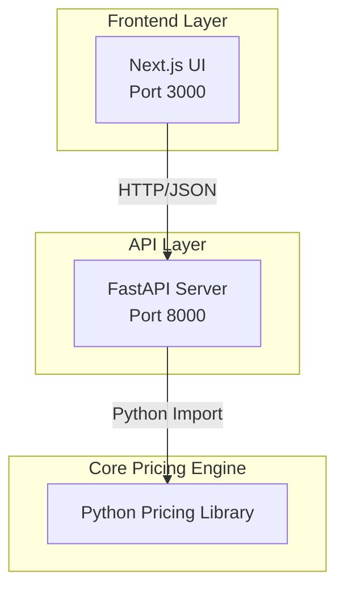
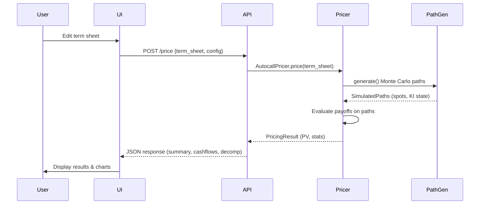
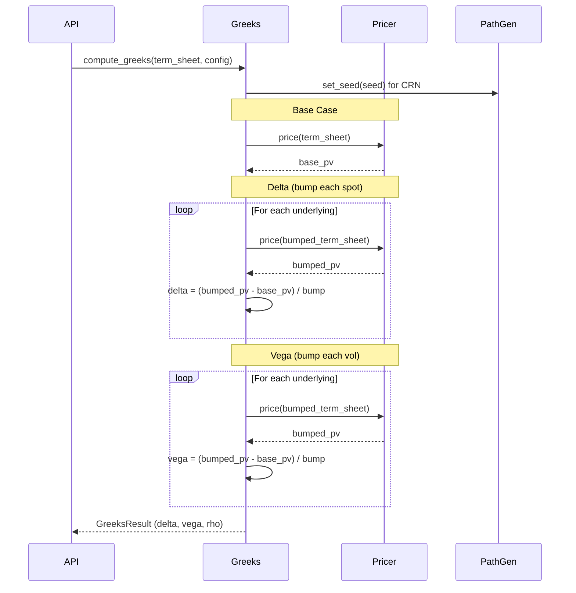

# System Architecture Overview

## High-Level Architecture

The Pricer system consists of three main components that work together to provide a complete structured products pricing solution:



## Component Details

### 1. Backend (Core Pricing Library)

**Location**: `backend/src/pricer/`

The backend is a standalone Python library that can be used independently or through the API. It's organized into focused modules:

```
pricer/
├── core/              # Core utilities (calendar, day count, schedule)
├── engines/           # Pricing engines (Monte Carlo, Black-Scholes, trees)
├── market/            # Market data (rates, volatility, dividends, correlation)
├── pricers/           # Product pricers (autocall, vanilla)
├── products/          # Product schemas and definitions
├── reporting/         # Cashflow reports and PV decomposition
├── risk/              # Greeks calculation
└── utils/             # Utilities (profiling, memory tracking)
```

**Key Classes**:
- `TermSheet`: Pydantic schema for product specification
- `AutocallPricer`: Main pricer for autocallable products
- `PathGenerator`: Monte Carlo path simulation with Brownian bridge
- `compute_greeks()`: Greeks calculation with Common Random Numbers

### 2. API (FastAPI Server)

**Location**: `api/`

RESTful API that wraps the backend library, providing HTTP endpoints for pricing and risk analysis.

**Architecture**:
```
api/
├── main.py            # FastAPI app with router registration
├── routers/           # Endpoint routers (pricing, risk, vanilla, market data)
├── models/            # Pydantic request/response models
└── middleware/        # Error handling, logging, timing
```

**Key Endpoints**:
- `POST /price` - Price a structured product
- `POST /risk` - Calculate Greeks and risk metrics
- `POST /vanilla/price` - Price vanilla options (BS, binomial, trinomial)
- `GET /market-data` - Fetch live market data (if yfinance installed)

### 3. UI (Next.js Web Interface)

**Location**: `ui/`

Modern React-based web interface for interactive pricing and visualization.

**Features**:
- Monaco editor for term sheet JSON editing
- Real-time pricing and Greeks calculation
- Cashflow tables and PV decomposition charts
- Configurable simulation parameters

## Data Flow

### Pricing Workflow



### Greeks Calculation Workflow



## Monte Carlo Pricing Engine

### Path Generation

The `PathGenerator` class implements multi-asset Geometric Brownian Motion with advanced features:

**Key Features**:
1. **Correlated Multi-Asset Simulation**: Uses Cholesky decomposition for correlation
2. **Piecewise Constant Volatility**: Different vol per time bucket
3. **Discrete Dividends**: Spot jumps on ex-dividend dates
4. **Brownian Bridge**: Continuous barrier monitoring between discrete time steps
5. **Antithetic Variates**: Variance reduction (optional)
6. **Block Processing**: Memory-efficient simulation in blocks

**Algorithm**:
```python
# For each time step t:
# 1. Generate correlated random numbers: Z = L @ N(0,1)
# 2. Apply dividend jumps if ex-date
# 3. Evolve spots: S(t+1) = S(t) * exp((r-q-0.5*σ²)*dt + σ*sqrt(dt)*Z)
# 4. Check Brownian bridge for barrier hits between t and t+1
```

### Event Engine

The `EventEngine` evaluates autocall and coupon events on simulated paths:

**Process**:
1. For each observation date, check autocall condition (worst-of spot vs barrier)
2. If autocalled, record redemption and stop path
3. If not autocalled, check coupon condition and accumulate coupons
4. At maturity, check knock-in and apply appropriate redemption

### Payoff Calculation

```python
# Simplified autocall payoff logic:
for path in paths:
    for obs_date in observation_dates:
        worst_performance = min(S[asset] / S0[asset] for asset in assets)
        
        if worst_performance >= autocall_barrier:
            # Autocall triggered
            redemption = notional * (1 + autocall_coupon)
            pv += redemption * discount_factor
            break
        
        if worst_performance >= coupon_barrier:
            # Coupon paid
            coupon = notional * coupon_rate
            pv += coupon * discount_factor
    
    else:  # Not autocalled, reached maturity
        if ki_triggered:
            # Worst-of physical settlement or cash
            redemption = notional * worst_performance
        else:
            # Principal protected
            redemption = notional
        
        pv += redemption * discount_factor
```

## Technology Stack

### Backend
- **Python 3.11+**: Core language
- **NumPy**: Array operations and Monte Carlo simulation
- **SciPy**: Statistical functions and optimization
- **Pydantic**: Schema validation and type safety
- **Pandas**: Data manipulation and reporting

### API
- **FastAPI**: Modern async web framework
- **Uvicorn**: ASGI server
- **CORS Middleware**: Cross-origin support for UI

### UI
- **Next.js 14**: React framework with App Router
- **TypeScript**: Type-safe frontend code
- **Monaco Editor**: JSON term sheet editing
- **Recharts**: Data visualization
- **Tailwind CSS**: Styling

### Development Tools
- **pytest**: Testing framework
- **mypy**: Static type checking
- **ruff**: Fast Python linter and formatter
- **pre-commit**: Git hooks for code quality

## Performance Considerations

### Memory Management

Monte Carlo simulation can be memory-intensive. The system uses several strategies:

1. **Block Processing**: Simulate paths in blocks (default 50,000) to limit memory
2. **Float32 for Paths**: Use `np.float32` for spot paths (half the memory of float64)
3. **Float64 for Accumulation**: Use `np.float64` for PV accumulation to avoid precision loss
4. **Memory Estimation**: Utility to estimate memory usage before simulation

### Computation Optimization

1. **Vectorized Operations**: NumPy vectorization for all path operations
2. **Common Random Numbers**: Reuse random seed for stable Greeks
3. **Antithetic Variates**: Optional variance reduction (2x paths for same randoms)
4. **Cholesky Caching**: Compute correlation Cholesky once and reuse

### Typical Performance

On a modern CPU (e.g., Apple M1):
- **100k paths, 36 steps, 3 assets**: ~500ms
- **1M paths, 36 steps, 3 assets**: ~4s
- **Greeks (5 bumps), 100k paths**: ~2.5s

## Deployment

### Local Development
```bash
# Backend
pip install -e ./backend[dev]

# API
cd api && uvicorn main:app --reload --port 8000

# UI
cd ui && npm run dev
```

### Docker Compose
```bash
docker-compose up
```

### Production (Render/Vercel)
- **API**: Deploy to Render using `render.yaml`
- **UI**: Deploy to Vercel (auto-detected Next.js)
- **Backend**: Installed as dependency in API container

## Security Considerations

1. **Input Validation**: Pydantic schemas validate all inputs
2. **CORS**: Configured for specific origins (localhost, production domains)
3. **Rate Limiting**: Consider adding for production API
4. **API Keys**: Not currently implemented (add if needed for production)

## Future Enhancements

Potential areas for expansion:

1. **More Product Types**: Barrier reverse convertibles, range accruals
2. **Advanced Vol Models**: Full Heston, SABR
3. **Calibration**: Vol surface calibration to market prices
4. **Sensitivities**: Cross-gamma, vanna, volga
5. **Parallel Processing**: Multi-core path generation
6. **GPU Acceleration**: CUDA for massive path counts
7. **Database**: Store pricing history and term sheets
8. **Authentication**: User management and API keys
